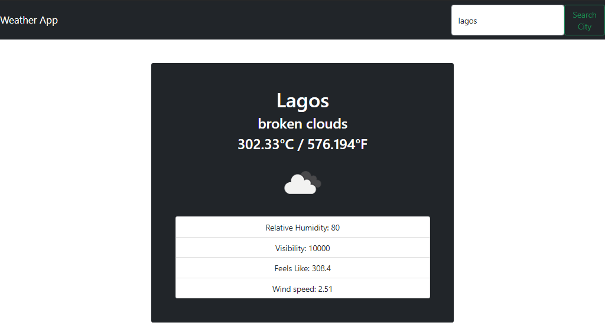

# Project: Weather-App

> A Front-end web application that fetches the current weather data about a specified location/region/country using the http://api.openweathermap.org/ API.



## Live demo

🔗 [visit the page](https://practical-meitner-6d41ad.netlify.app/)

## Built With

- Javascript (ES6)
- HTML / CSS
- Webpack

## Getting Started

To get a local copy up and running follow these simple steps.

### Prerequisites

In order for ```Weather-App``` to work locally on your machine, you need these installations:
- Nodejs and npm
- Web Browser

### Install

1) Open the Terminal
2) Run

```sh
git clone 
```

3) Run ```cd weather-App``` to enter the main directory
4) Run ```npm install```
5) Run ```npm run build```
6) Run ```cd dist/```
8) Open the ```index.html``` in your browser
9) Search for weather data in any region/city/country of choice
`

## Author

👤 **RALPH OBURU**

- Github: [@ralph-1](https://github.com/ralph-1)
- Twitter: [@NotRalph0](https://twitter.com/@NotRalph0)
- Linkedin: [Ralph](https://www.linkedin.com/in/ralph-oburu/)


## 🤝 Contributing

Contributions, issues and feature requests are welcome!

Feel free to check the [issues page](issues/).

## Show your support

Give a ⭐️ if you like this project!

## Acknowledgments
